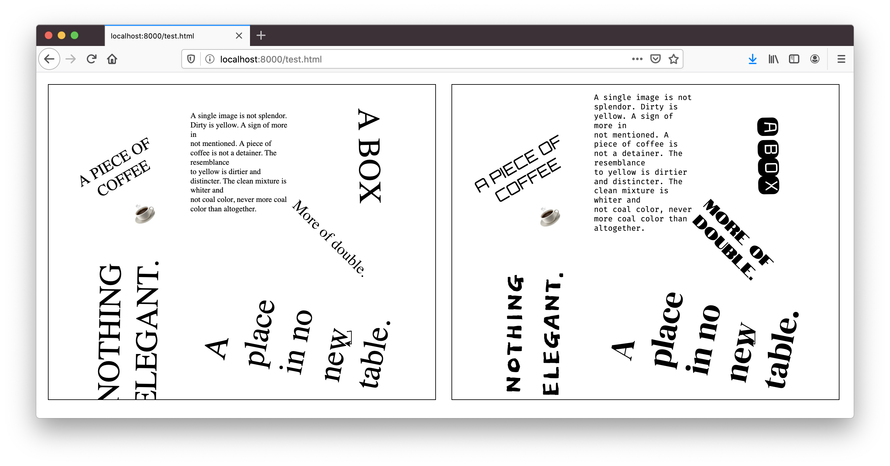

# svgum

A tool for gluing webfonts into SVG documents

SVGs with linked webfonts [do](https://css-tricks.com/using-custom-fonts-with-svg-in-an-image-tag/) [not](https://graphicdesign.stackexchange.com/questions/5162/how-do-i-embed-google-web-fonts-into-an-svg) [work](https://www.w3.org/wiki/SVG_Security) in `` tags. You will likely run into this issue when using SVGs from tools like [diagrams.net](https://app.diagrams.net/) in your HTML.

This tool solves the problem by downloading all fonts and inlining them as
Data URLs in the SVG document.

Before and after:



## Usage

```
npm install -g svgum
svgum <source> <target>
```

## Google Fonts Optimizations

The tool infers which letters are used by scanning the SVG for font definitions. The letters are then [passed to Google Fonts](https://fonts.googleblog.com/2011/04/streamline-your-web-font-requests.html) for each font so the most optimized font file can be returned. This optimization results in a dramatically smaller file size.

The optimization is most efficient when the document contains many fonts and/or few characters.

In [this example](test/before.svg), the optimization reduces the document size from **1.5 MB** to to **41 KB**, that's about **40X smaller!**

If you for some reason don't want to optimization, you can pass the flag `--deoptimize`.
